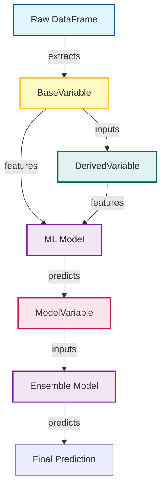

# VarFrame

[](https://badge.fury.io/py/varframe)
[](https://pypi.org/project/varframe/)
[](https://opensource.org/licenses/MIT)

**Declarative DataFrame variable management with automatic DAG dependency resolution and ML model integration.**

---

## What is VarFrame?

VarFrame is a library that allows you to define DataFrame columns as **Python classes** rather than imperative scripts. It manages dependencies, types, and execution order automatically using a generic DAG (Directed Acyclic Graph) solver.

It is designed for **complex, production-grade data pipelines** where traceability, correctness, and structure are more important than raw implementation speed.



## Why VarFrame?

### The Problem with Traditional Scripts
In traditional pandas scripts (`df['b'] = df['a'] + 1`), logic is often:
- **Fragile**: Reordering cells or lines breaks dependencies silently.
- **Opaque**: It's hard to tell *exactly* which columns are needed effectively.
- **Hard to Test**: You have to test "intermediate states" of a large dataframe.

### The VarFrame Solution
VarFrame treats variables as **definitions** (Classes) rather than **steps**.

| Feature | VarFrame | Traditional Script |
| :--- | :--- | :--- |
| **Dependency Resolution** | **Automatic (DAG)**. Order doesn't matter; the framework solves it. | **Manual**. You must order operations correctly yourself. |
| **Logic Encapsulation** | Logic, metadata, and types live in one Class. Self-documenting. | Distributed across scripts. logic often mixed with execution. |
| **ML Integration** | Models are just "Computed Variables". Predictions are treated like any other column. | Often separate "training" and "inference" pipelines. |
| **Testing** | Unit test single `calculate(df)` methods in isolation. | Integration testing entire scripts is required. |

### Best For
- **Feature Stores**: Reuse definitions across training and serving.
- **Complex DAGs**: When variable F depends on E, which depends on D, C, and B...
- **Ensemble/Stacking**: Where model predictions feed into other models (see `examples/ensemble_demo.py`).

## Installation

```bash
pip install varframe           # Core only (pandas)
pip install varframe[ml]       # + scikit-learn, joblib
pip install varframe[all]      # Everything
```

## Quick Start

### 1. Define Variables

```python
from varframe import BaseVariable, DerivedVariable, VarFrame

# Map a raw column with type enforcement
class Lap(BaseVariable):
    """Current lap number."""
    name = "lap"
    raw_column = "lap_num"
    dtype = "int"

class Gap(BaseVariable):
    """Gap to leader in seconds."""
    name = "gap"
    raw_column = "gap_to_leader"
    dtype = "float"

# Create a computed column with dependencies
class GapDelta(DerivedVariable):
    """Change in gap from previous row."""
    name = "gap_delta"
    dependencies = [Gap]
    
    @classmethod
    def calculate(cls, df):
        return df["gap"] - df["gap"].shift(1)
```

### 2. Create a VarFrame

```python
import pandas as pd

# Raw data with original column names
df_raw = pd.DataFrame({
    "lap_num": [1, 2, 3],
    "gap_to_leader": [0.0, 1.2, 0.8]
})

# Create VarFrame - columns are computed automatically
# Dependencies are resolvd automatically!
vf = VarFrame(df_raw, [Lap, Gap, GapDelta])

print(vf)
#    lap  gap  gap_delta
# 0    1  0.0        NaN
# 1    2  1.2        1.2
# 2    3  0.8       -0.4
```

### 3. Access Variables

```python
# By name
vf["gap"]

# By class
vf[Gap]

# Multiple variables
vf[[Lap, Gap]]

# Filter by type
vf.filter_by_type(DerivedVariable)  # Only computed columns
```

## ML Model Integration

Define models declaratively and use predictions as variables:

```python
from varframe import BaseModel, ModelVariable
from sklearn.ensemble import RandomForestRegressor

class GapPredictor(BaseModel):
    """Predicts future gap based on features."""
    name = "gap_predictor"
    inputs = [Lap, Gap]
    target = GapDelta
    model_class = RandomForestRegressor
    hyperparameters = {"n_estimators": 100, "max_depth": 5}

# Train the model
GapPredictor.train(training_vf)

# Use predictions as a variable
class PredictedGapDelta(ModelVariable):
    name = "predicted_gap_delta"
    model_class = GapPredictor

vf.add_variables(PredictedGapDelta)
```

## API Reference

### Variable Classes

| Class | Purpose |
|-------|---------|
| `BaseVariable` | Maps a raw column (with optional dtype conversion) |
| `DerivedVariable` | Computed from other variables via `calculate()` |
| `ModelVariable` | Predictions from an ML model |

### VarFrame Methods

| Method | Description |
|--------|-------------|
| `add_variables(*vars, compute=True)` | Compute and add new variables (or register if compute=False) |
| `add_variable(*vars)` | Alias for `add_variables(*vars)` |
| `filter_by_type(type)` | Filter to `BaseVariable` or `DerivedVariable` only |
| `get_variable(name)` | Get variable class by name |
| `list_variables()` | List all variable names |
| `describe_variables()` | Summary DataFrame of all variables |
| `to_pandas()` / `to_ml()` | Convert to plain DataFrame for ML pipelines |

### BaseModel Methods

| Method | Description |
|--------|-------------|
| `train(vf)` | Train on a VarFrame |
| `predict(vf)` | Generate predictions |
| `evaluate(vf)` | Compute metrics |
| `save(path)` / `load(path)` | Persist and restore model |

## License

MIT
